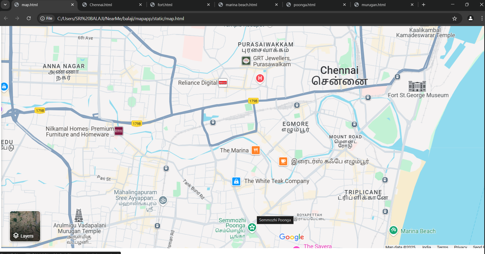

# Ex04 Places Around Me

## Date: 

## AIM
To develop a website to display details about the places around my house.

## DESIGN STEPS

### STEP 1
Create a Django admin interface.

### STEP 2
Download your city map from Google.

### STEP 3
Using ```<map>``` tag name the map.

### STEP 4
Create clickable regions in the image using ```<area>``` tag.

### STEP 5
Write HTML programs for all the regions identified.

### STEP 6
Execute the programs and publish them.

## CODE
```
map.html

<html>
    <body>
        <h1 align="center">
            <font color="red"><b>CHENNAI</b></font>
        </h1>
        <h2 align="center">
          <b>
            SRIBALAJI S (24900249)
          </b>  
        </h2>
        <h3 align="center">
            

<map name="image-map">
    <area target="_blank" alt="Chennai" title="Chennai" href="Chennai.html" coords="957,335,1160,428" shape="rect">
    <area target="_blank" alt="Fort St.George Museum" title="Fort St.George Museum" href="fort.html" coords="1203,362,1415,467" shape="rect">
    <area target="_blank" alt="Semmozhi Poonga " title="Semmozhi Poonga " href="poonga.html" coords="641,797,828,907" shape="rect">
    <area target="_blank" alt="Marina Beach" title="Marina Beach" href="marina beach.html" coords="1186,831,1384,893" shape="rect">
    <area target="_blank" alt="Arulmigu Vadapalani Murugan Temple" title="Arulmigu Vadapalani Murugan Temple" href="murugan.html" coords="147,785,349,915" shape="rect">
    <area target="_blank" alt="GRT Jewellers" title="GRT Jewellers" href="GRT.html" coords="720,304,919,370" shape="rect">
</map>

        </h3>
    </body>
</html>

chennai.html

<html>
<body bgcolor="lavender">
    <h1 align="center">
        <font color="red">
           CHENNAI
        </font>
    </h1>
    <h2 align="center">
        Chennai
    </h2>
    <h3>
        <hr>
        <li>
            <font size="5">
                Chennai, formerly known as Madras, is a vibrant and culturally rich city in the southern state of Tamil Nadu, India.
                 As the capital of the state, it serves as a major hub for commerce, education, and art. Here’s a quick dive into what makes Chennai.
            </font>
        </li>
        <li>
            <font size="5">
                Chennai is known as the cultural capital of south india,boasting a rich tradition of classical,musicand art.
                </font>
                </li>
                <li>
                    <font size="5">
                        The city also has a thriving theater scene and a significant Tamil film industry, Kollywood.
            </font>
            </li>
            <li>
                <font size="5">
                    Several national-level banks and financial institutions are headquartered in Chennai.
            </font>
            </li>
            </font>
        </li>
        <li>
            <font size="5">
                Chennai is a leading destination for medical tourism, offering advanced healthcare facilities.
            </font>
        </li>
    </h3>

</body>

</html>

fort.html

<html>

<body bgcolor="#E0FFFF">
    <h1 align="center">
        <font color="red">
            CHENNAI
        </font>
    </h1>
    <h2 align="center">
        Fort St.George Museum
    </h2>
    <h3>
        <hr>
        <li>
            <font size="5">
                Features portraits and oil paintings of prominent figures such as King George III, Queen Victoria,
                Robert Clive, and the Governors of Madras.
            </font>
        </li>
        <li>
            <font size="5">
                
                Displays a variety of weaponry, including swords, daggers, rifles, pistols, mortars, and even fragments of shells from World War I and II attacks on Madras.
            </font>
        </li>
        <li>
            <font size="5">
                Exhibits porcelain used by the East India Company and the Arcot Nawabs.
            </font>
        </li>
        <li>
            <font size="5">
                Includes sketches, aquatints depicting Indian monuments and scenery,
                 and original letters written by figures like Robert Clive.
            </font>
        </li>
        </font>
        </li>
        <li>
            <font size="5">
                Features clocks, seals, furniture, lampshades, and coins issued by the French in India.
            </font>
        </li>
    </h3>

</body>

</html>

murugan.html

<html>

<body bgcolor="#E0FFFF">
    <h1 align="center">
        <font color="red">
           CHENNAI
        </font>
    </h1>
    <h2 align="center">
        Arulmigu Vadapalani Murugan Temple
    </h2>
    <h3>
        <hr>
        <li>
            <font size="5">
                The temple is dedicated to Lord Murugan, the Hindu god of war and the son of Lord Shiva and Goddess
                Parvati.
            </font>
        </li>
        <li>
            <font size="5">
                The temple features Dravidian-style architecture, with intricately carved pillars, and is known for its
                peaceful and spiritual ambiance.
            </font>
        </li>
        <li>
            <font size="5">
                The Murugan Temple in Chennai is believed to have been constructed several decades ago by the Tamil Nadu
                Government for the worship of Lord Murugan, and it holds significant cultural value in the region.
            </font>
        </li>
        <li>
            <font size="5">
                A popular pilgrimage site for devotees of Lord Murugan, especially during the festivals of Thaipusam and
                Skanda Shashti.
                The temple is also an important place for those seeking peace and spiritual solace.
            </font>
        </li>
        </font>
        </li>
        <li>
            <font size="5">
                Apart from its religious significance, the temple is also a popular spot for tourists who wish to enjoy
                a combination of spirituality and scenic beauty in the chennai city 
          </font>
        </li>
    </h3>

</body>

</html>

marina beach.html

<html>

<body bgcolor="ivory">
    <h1 align="center">
        <font color="red">
           CHENNAI
        </font>
    </h1>
    <h2 align="center">
        Marina Beach
    </h2>
    <h3>
        <hr>
        <li>
            <font size="5">
                Locals and visitors alike flock to the beach for refreshing morning walks, jogging, and yoga sessions,
                 enjoying the sunrise and the cool sea breeze.
            </font>
        </li>
        <li>
            <font size="5">
                The vast expanse of golden sand provides ample space for leisurely strolls and simply relaxing by the waves. 
            </font>
        </li>
        <li>
            <font size="5">
                The beach is famous for its diverse street food scene.
                 Visitors can savor local delicacies like sundal (spiced chickpeas), roasted corn, bajji (fritters), and fresh coconut water.

            </font>
        </li>
        <li>
            <font size="5">
                The scenic beauty of the beach, especially during sunrise and sunset, makes it a favorite spot for photographers.
            </font>
        </li>
        </font>
        </li>
        <li>
            <font size="5">
                Located along the Marina, the Chennai Aquarium houses various species of fish and marine life,
                 making it an interesting visit for all ages.
            </font>
        </li>
    </h3>

</body>

</html>
```
## OUTPUT



## RESULT
The program for implementing image maps using HTML is executed successfully.

